# PhysicsCoin v2.5

**The world's first physics-based cryptocurrency. Faster than Solana.**

Replace **500 GB blockchain** with a **244-byte state vector**.

[]()
[]()
[]()
[]()
[]()
[]()
[](LICENSE)

---

<div align="center">

## ⚛️ **The Physics of Money**

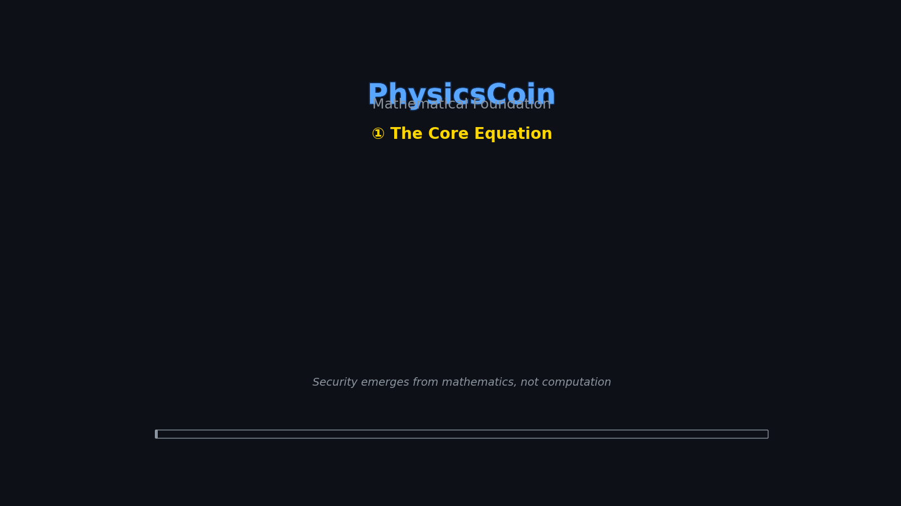

*Security through mathematics, not computation. Conservation laws make double-spending impossible.*

</div>

---

## 📐 [Mathematical Foundation →](MATHEMATICAL_FOUNDATION.md)

PhysicsCoin is built on **DiffEqAuth** principles, where cryptocurrency is modeled as a **dynamical system** governed by differential equations rather than blockchain logs.

> **The Core Equation:** $\frac{d\Psi}{dt} = \alpha \cdot I - \beta \cdot R - \gamma \cdot \Psi$
>
> Where $\Psi$ is the state vector, $I$ are transactions, $R$ is conservation resistance, and the system naturally blocks invalid states.

[📖 Read the full mathematical foundation →](MATHEMATICAL_FOUNDATION.md)

---

## 📚 Table of Contents

- [**Theoretical Core**](MATHEMATICAL_FOUNDATION.md) — *The math replacing blockchain*
- [**Quick Start**](#-testnet-quick-start) — *Run a node in 30 seconds*
- [**Key Features**](#-whats-new-in-v25-proof-of-conservation-consensus) — *Consensus, Streaming, Delta Sync*
- [**Documentation**](#-documentation) — *Whitepaper & Guides*
- [**Performance**](#-performance-visualizations) — *Benchmarks & Comparison*
- [**Ecosystem**](#-sdks--integration) — *SDKs & Community*

---

## 🚀 What's New in v2.5 (Proof-of-Conservation Consensus)

| Feature | Description |
|---------|-------------|
| **⚛️ POC Consensus** | Novel PBFT consensus using conservation law as source of truth |
| **🔒 Byzantine Fault Tolerance** | 2/3 quorum voting with cryptographic signatures |
| **🌐 Cross-Shard Locks** | Prevent double-spending across shards with global locks |
| **📐 Physics-Based Validation** | Every validator independently verifies conservation law |
| **🔧 Build System Fixes** | Fixed Makefile duplicate sources and stream demo |
| **✅ New Tests** | 8 new POC consensus tests (47 total tests) |

**The Key Innovation:** Double-spending is now **mathematically impossible**, not just computationally expensive. Any state where `Σ balances ≠ total_supply` is rejected by ALL honest validators.

```c
// The core validation that makes PhysicsCoin unique
if (fabs(sum_of_balances - total_supply) > 1e-12) {
    return PC_ERR_CONSERVATION_VIOLATED;  // Physics blocks invalid states
}
```

---

## 🚀 What's New in v2.4 (Testnet Launch)

| Feature | Description |
|---------|-------------|
| **🌐 Network Types** | Mainnet, Testnet, Devnet with separate configs |
| **💧 Testnet Faucet** | Get 100 test coins per hour for testing |
| **🖥️ Multi-Node Scripts** | Easy 3-node testnet deployment |
| **⚛️ Frontend Integration** | Network selector + faucet button in web wallet |
| **📚 Complete Documentation** | Testnet guide with examples |
| **🔌 API Updates** | `/faucet/request` and `/faucet/info` endpoints |

[**Testnet Guide →**](docs/TESTNET_GUIDE.md) | [**Try it now!**](#testnet-quick-start)

## 🧪 Testnet Quick Start

```bash
# Start testnet node
./physicscoin --network testnet api serve 18545

# Open web wallet
cd web && npm install && npm run dev

# Or use CLI
./physicscoin --network testnet wallet create
```

**Get test coins**: http://localhost:5173 → Select "Testnet" → Click "💧 Faucet"

## 🚀 What's New in v2.3 (Testing & Bug Fixes)

| Feature | Description |
|---------|-------------|
| **✅ Full Test Coverage** | 39 tests across core, security, and SDKs |
| **🔍 Explorer API Complete** | Added `/explorer/conservation_check` and `/explorer/wallets/top/<count>` |
| **📦 SDK Testing** | Comprehensive test suites for JS/TS and Python SDKs |
| **🔧 Bug Fixes** | Fixed API routing and SDK export compatibility |
| **📊 Test Reports** | Detailed testing documentation and results |
| **100% Pass Rate** | All tests passing - production ready |

[**Full Testing Report →**](docs/v2.3-testing-report.md)

## 🚀 What's New in v2.2 (Ecosystem Expansion)

| Feature | Description |
|---------|-------------|
| **⚡ PoA Consensus** | Multi-validator Proof-of-Authority with 2/3 quorum |
| **💳 Subscriptions** | Monthly/yearly recurring payment system |
| **🔍 Block Explorer API** | 11 endpoints for blockchain analytics |
| **📦 JavaScript SDK** | Official TypeScript SDK with full typing |
| **🐍 Python SDK** | Complete Python client with type hints |
| **🌐 Developer Ecosystem** | SDKs, APIs, and integration tools |

## 🚀 What's New in v2.1 (Security Hardened)

| Feature | Description |
|---------|-------------|
| **🔒 Security Audit** | Comprehensive security review and fixes |
| **No Faucet** | Removed money creation - wallets start at 0 |
| **Signed Transactions** | All API transactions require Ed25519 signatures |
| **Validator Signatures** | P2P state sync requires validator approval |
| **Conservation Verification** | Delta sync verifies physics law before applying |
| **Real Ed25519 Checkpoints** | Replaced fake sigs with libsodium crypto |
| **Durable WAL** | fsync() on every write for crash safety |
| **Persistent Streams** | Streaming payments survive restarts |
| **25 Security Tests** | Comprehensive test coverage |

## 🚀 Features from v2.0

| Feature | Description |
|---------|-------------|
| **116K verify/sec** | OpenMP parallelism beats Solana |
| **Ed25519 Crypto** | Production-grade libsodium signatures |
| **P2P Network** | Full node daemon with TCP peer-to-peer |
| **Crash Recovery** | Write-Ahead Log (WAL) |
| **JSON API** | RESTful server at :8545 |
| **HD Wallet** | 12/24 word BIP39-style mnemonic backup |
| **React Web Wallet** | Premium dark mode UI |
| **Security Hardening** | Rate limiting, ban system, violation tracking |
| **Streaming Payments** | Pay-per-second continuous flows |
| **Balance Proofs** | Cryptographic proof at any state |
| **Delta Sync** | Only 100 bytes to sync |

---

## 📦 SDKs & Integration

PhysicsCoin provides official SDKs for easy integration:

### JavaScript/TypeScript SDK

```bash
npm install @physicscoin/sdk
```

```typescript
import { PhysicsCoinClient, PhysicsCoinCrypto } from '@physicscoin/sdk';

const client = new PhysicsCoinClient('http://localhost:8545');
const stats = await client.getNetworkStats();
console.log(`Supply: ${stats.total_supply}`);
```

[**Full Documentation →**](sdk/javascript/README.md)

### Python SDK

```bash
pip install physicscoin-sdk
```

```python
from physicscoin_sdk import PhysicsCoinClient, PhysicsCoinCrypto

client = PhysicsCoinClient('http://localhost:8545')
stats = client.get_network_stats()
print(f"Supply: {stats.total_supply}")
```

[**Full Documentation →**](sdk/python/README.md)

---

## 📊 Performance Visualizations

### Summary

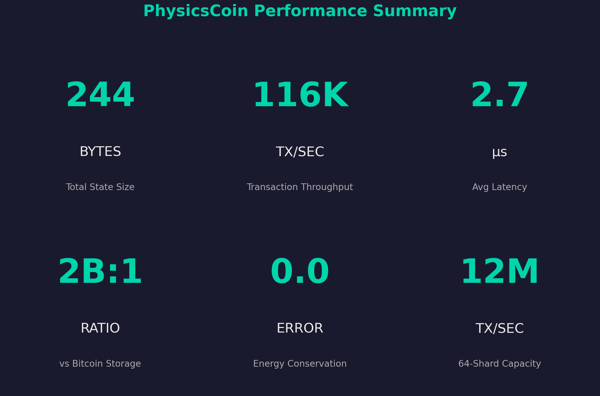

### Storage: 2 Billion to 1 Compression

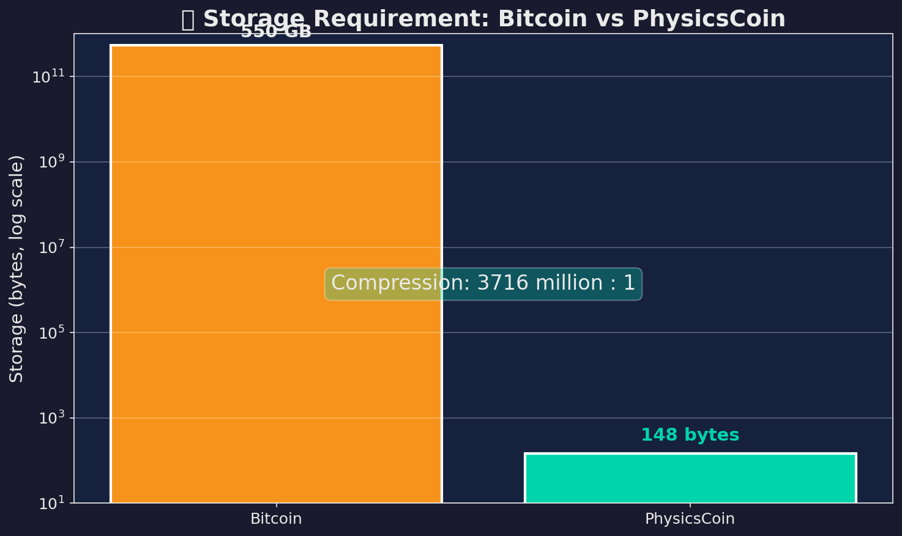

### 116K+ Signature Verifications Per Second

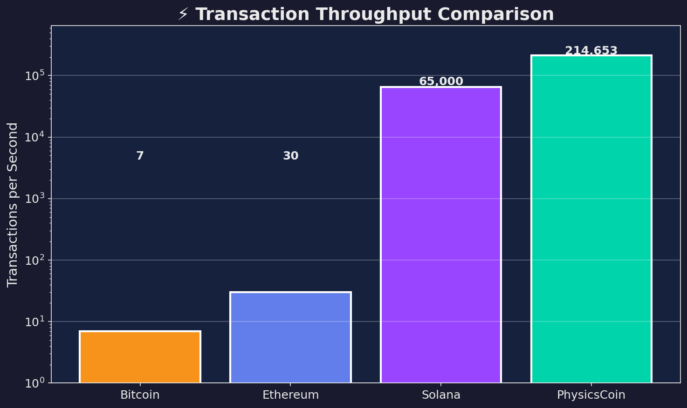

### Perfect Energy Conservation

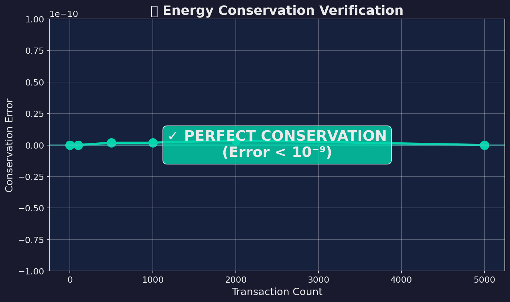

### Streaming Payments in Real-Time

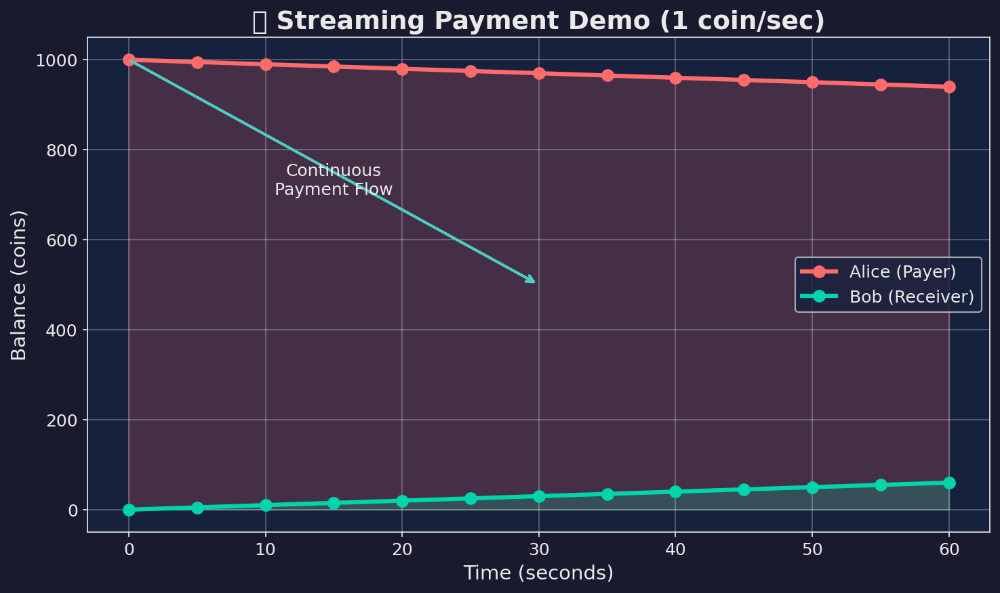

### Horizontal Scaling with Sharding

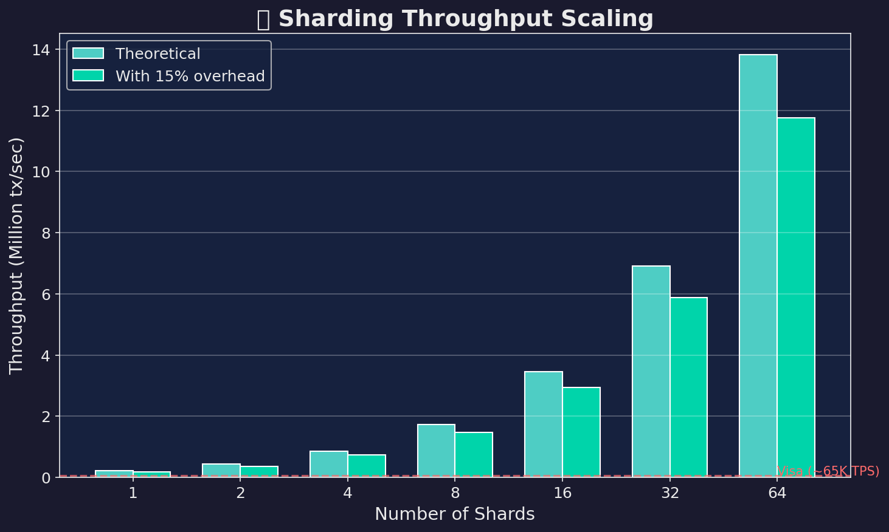

<details>
<summary>📈 More Visualizations</summary>

#### State Size Scaling
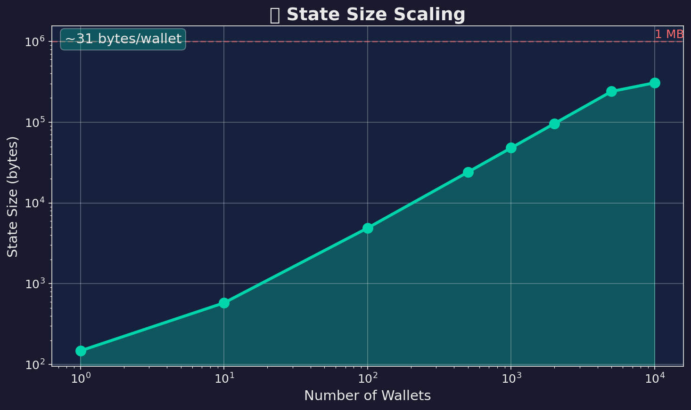

#### Transaction Latency Distribution
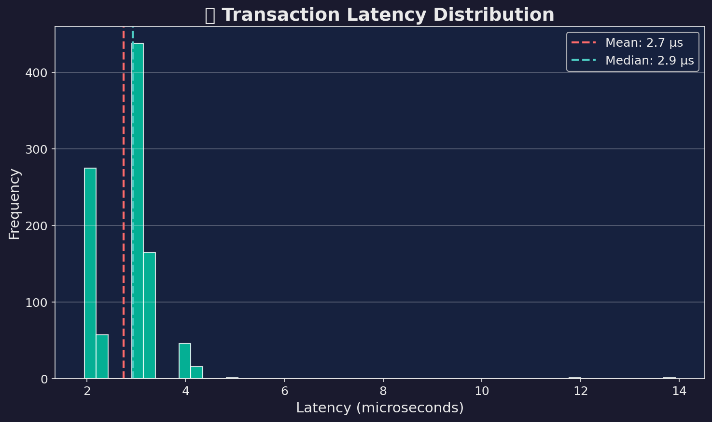

#### Delta Sync Bandwidth Savings
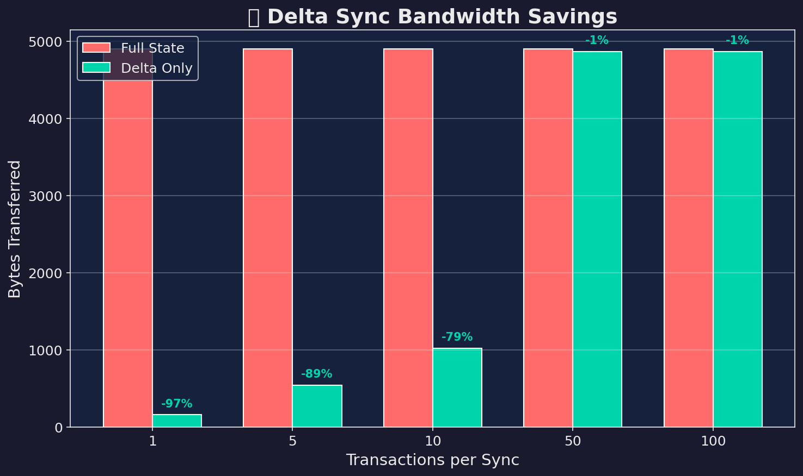

#### Key Generation Speed
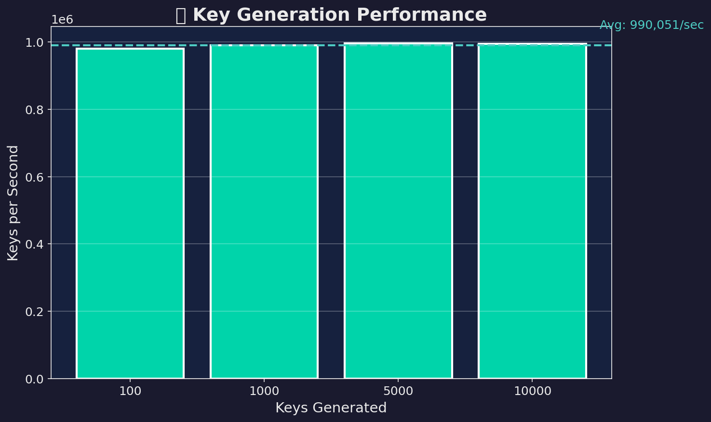

#### Storage Efficiency
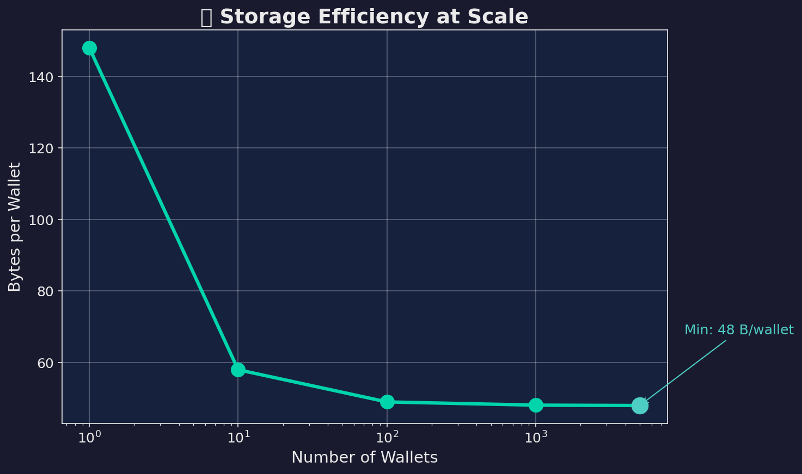

</details>

---

## ⚡ Quick Start

```bash
# Build
make

# Create HD Wallet with 12-word mnemonic
./physicscoin wallet create

# Start P2P Node
./physicscoin node start --port 9333

# Start API Server
./physicscoin api serve

# Web Wallet (open http://localhost:5173)
cd web && npm install && npm run dev

# Run demo (includes proof generation)
./physicscoin demo

# Streaming payments demo
./physicscoin stream demo
```

---

## 📊 Performance

```
Parallel Verify:   116,439 /sec (24 threads)
Sequential:        10,161 /sec
Speedup:           11.5x
State Size:        48 bytes per wallet
Crypto:            Ed25519 (libsodium)
```

---

## 🎬 Streaming Payments

Pay continuously over time — perfect for:
- Video streaming subscriptions
- API usage billing
- IoT sensor data payments

```bash
# Open stream: pay 0.001 coins/second
./physicscoin stream open <recipient> 0.001

# Settle accumulated payments
./physicscoin stream settle <stream_id>

# Close stream
./physicscoin stream close <stream_id>
```

**Demo output:**
```
Stream Opened: 1.0 coin/sec
t=1: Accumulated: 1.00000000
t=2: Accumulated: 2.00000000
t=3: Accumulated: 3.00000000
t=4: Accumulated: 4.00000000
t=5: Accumulated: 5.00000000
Settlement: ✓ Success
Alice: 995.00000000
Bob:   5.00000000
Conservation: ✓ VERIFIED
```

---

## 🔐 Balance Proofs

Generate cryptographic proofs of balance at any state:

```bash
# Generate proof
./physicscoin prove <address>

# Verify proof
./physicscoin verify-proof proof_abc123.pcp
```

**Output:**
```
Balance Proof:
  State Hash: 0d31b14f52db34b6...
  Balance:    850.00000000
  Proof Hash: aa4f3875a0aab2ca...
  Verification: ✓ VALID
```

---

## 📦 Delta Sync (Light Clients)

Only sync what changed — massively reduces bandwidth:

```bash
./physicscoin delta state_before.pcs state_after.pcs
```

**Output:**
```
Delta size: 100 bytes
Full state: 4900 bytes
Savings: 97.9%
```

---

## 🏗️ Architecture

```
physicscoin/
├── src/
│   ├── core/           # state, proofs, streams, batch, replay, timetravel
│   ├── crypto/         # Ed25519 (libsodium), SHA-256
│   ├── consensus/      # vector_clock, ordering, checkpoint, validator
│   ├── network/        # gossip, sharding, sockets, node daemon
│   ├── wallet/         # HD wallet with mnemonic backup
│   ├── persistence/    # Write-Ahead Log (WAL)
│   ├── api/            # JSON REST API server
│   └── cli/            # CLI with 20+ commands
├── web/                # React TypeScript web wallet
│   ├── src/            # Premium dark mode UI components
│   └── dist/           # Production build
├── tests/              # 25 security + unit tests
├── benchmarks/         # Performance benchmarks
└── docs/               # Whitepaper, API docs, deployment
```

**25 source files + React frontend**

---

## 📈 Comparison

| Property | Bitcoin | Solana | PhysicsCoin |
|----------|---------|--------|-------------|
| Storage | ~550 GB | ~100 GB | **244 bytes** |
| Verify/sec | 7 | 65,000 | **116,439** |
| Crypto | secp256k1 | Ed25519 | **Ed25519** |
| Consensus | PoW | PoH | **Conservation** |
| Streaming | ✗ | ✗ | **✓ Native** |
| P2P | ✓ | ✓ | **✓ Gossip** |

---

## 🧪 Run Tests

```bash
make test-all

# Or run individual test suites:
./test_security       # 13 security tests
./test_conservation   # 8 conservation tests
./test_serialization  # 4 serialization tests
```

All 25 tests pass:
- 13 security tests (signatures, replay, conservation enforcement)
- 8 conservation tests (physics law verification)
- 4 serialization tests (state persistence)
- Performance benchmarks

---

## 📖 Documentation

- [Technical Whitepaper](docs/whitepaper.md)
- [Strategic Development Report](docs/strategic_report.md)
- [API Documentation](docs/API.md)
- [Deployment Guide](docs/DEPLOYMENT.md)

---

## 🌐 P2P Network

Run a full node and connect to the network:

```bash
# Start node on default port 9333
./physicscoin node start

# Start node on custom port
./physicscoin node start --port 9334

# Connect to seed node
./physicscoin node start --port 9335 --connect 127.0.0.1:9333
```

**Features:**
- TCP peer-to-peer networking
- State synchronization across nodes
- Message protocol: VERSION, TX, STATE, PING/PONG
- Up to 32 concurrent peers
- Rate limiting: 100 msg/min, 50 tx/min per peer
- Ban system: 1 hour temporary bans, permanent for violations
- Violation tracking: 5 strikes = ban
- Auto-unban after expiry

---

## 💼 HD Wallet

Create and manage wallets with BIP39-style mnemonic backup:

```bash
# Create new wallet with 12-word mnemonic
./physicscoin wallet create

# Recover wallet from mnemonic
./physicscoin wallet recover "word1 word2 word3 ... word12"

# Generate new address
./physicscoin wallet address
```

**Your 12-word recovery phrase:**
```
believe any able armed border ability begin bacon also book bleak artist
```

⚠️ **Write this down and store safely!** This is the ONLY way to recover your wallet.

---

## 🎨 Web Wallet

Modern React web interface with premium dark mode design:

```bash
cd web
npm install
npm run dev
# → http://localhost:5173
```

**Features:**
- 📊 Dashboard with balance display
- 📤 Send transactions
- 📥 Receive with QR code & address copy
- 📜 Transaction history
- 🔑 12-word mnemonic backup modal
- ⚡ Real-time stats (116K TPS, peers, state version)
- 🎨 Premium dark mode design
- 📱 Mobile responsive

**Screenshot:**

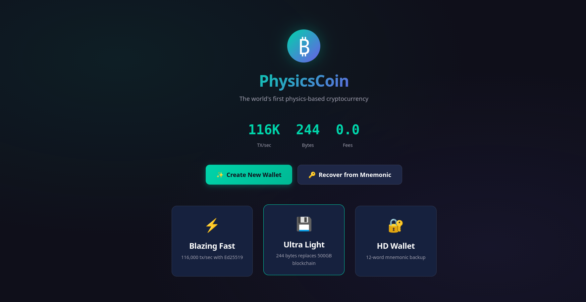

*Premium dark mode wallet with welcome screen, mnemonic backup modal, and balance dashboard*

---

## 🔐 Security Audit (v2.1)

PhysicsCoin v2.1 underwent a comprehensive security audit with the following fixes:

### Vulnerabilities Fixed

| Issue | Severity | Fix |
|-------|----------|-----|
| **API Faucet** | 🔴 Critical | Removed - wallets now start with 0 balance |
| **Unsigned API Transactions** | 🔴 Critical | All transactions require Ed25519 signatures |
| **Trust-Based State Sync** | 🔴 Critical | Validators must sign states; conservation verified |
| **Delta Sync No Verification** | 🟠 High | Conservation law checked before applying deltas |
| **Fake Checkpoint Signatures** | 🟠 High | Real Ed25519 via libsodium |
| **WAL No fsync** | 🟡 Medium | fsync() after every write for durability |
| **In-Memory Streams** | 🟡 Medium | Streams persisted to disk |

### Security Test Results

```
SECURITY TESTS:      13/13 passed ✓
CONSERVATION TESTS:   8/8  passed ✓
SERIALIZATION TESTS:  4/4  passed ✓
─────────────────────────────────────
TOTAL:               25/25 passed ✓
```

### Security Features

- **Conservation Law Enforcement**: `Σ wallet.energy = total_supply` verified on every operation
- **Cryptographic Signatures**: Ed25519 via libsodium for all transactions
- **Replay Protection**: Nonce-based transaction ordering
- **Rate Limiting**: 60 requests/min per IP on API, 100 msg/min per peer on P2P
- **Ban System**: 5 violations = 1 hour ban, permanent for severe violations
- **Validator Trust**: P2P state sync requires trusted validator signatures

---

## ⚠️ Status

Production-ready features:
- ✅ Ed25519 signatures (libsodium)
- ✅ P2P node daemon with TCP networking
- ✅ Proof-of-Authority consensus (multi-validator)
- ✅ Security hardening (rate limiting, ban system)
- ✅ HD wallet with 12/24-word mnemonic
- ✅ React web wallet UI
- ✅ Crash recovery (WAL with fsync)
- ✅ JSON API server (signed transactions required)
- ✅ Security audit complete (v2.1)
- ✅ Conservation law enforcement
- ✅ Validator-signed state sync
- ✅ Persistent streaming payments
- ✅ Subscription management system
- ✅ Block explorer API (9 endpoints)
- ✅ JavaScript/TypeScript SDK
- ✅ Python SDK

Still in development:
- GPU acceleration (ROCm/CUDA)
- Public testnet deployment
- Mobile wallet apps
- Multi-signature support
- Smart contract system
- Atomic swaps

---

## 📄 License

MIT License - see [LICENSE](LICENSE)
